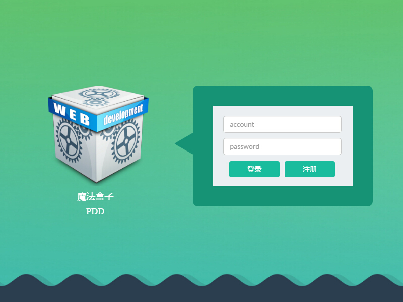

### tech
<ul>
  <li>生产环境:react+redux+electron+lowdb</li>
  <li>开发环境:webpack+babel</li>
  <li>electron有集成的audio和video,不存在mp3和mp4格式不支持问题</li>
</ul>
#项目中碰到的一些问题和解决思路
<ul>
  <li>关于如何保证store的唯一性
    <ul>
      <li>采用了electron+redux+store框架,生成对应的唯一store</li>  
      <li>这个框架内部实现是通过进程间通信,我猜想是clone</li>  
    </ul>
  </li>
  <li>关于openWindow之后出现空白页面且devtools error can't show anthing,disconnect
    <ul>
      <li>error:loadURL('./../index.html....')</li>  
      <li>correct:loadURL(`file://${__dirname}/index.html#/list`)</li>  
    </ul>
  </li>
  <li>需求:去除frame  添加drag元素拖拽功能  主要是进程间通信
    <ul>
      <li>子进程发射window-move   顺带传递数据</li>  
      <li>主进程接受数据  并展开计算</li>  
      <li>因为没有global变量  所以无法再子进程中获取win的数据</li>  
      <li>只能委托给主进程  并且在main中定义数组存储win数组</li>
    </ul>
  </li>
  <li>error:同时发射关闭和打开事件,有一个事件被忽略了
    <ul>
      <li>打个时间差,测试只要第二个打开的时间在关闭之后就ok</li>
      <li>懵逼了,原来是第一个关闭后就零窗口状态,默认这个状态整个进程就结束了...</li>    
    </ul>
  </li>
  <li>遇到的问题:本来需求是要用sqlite3数据库的,但是在编译这个东东的路上太坎坷了
    <ul>
      <li>比较适合的另外两个便携式数据库   lowdb   nedb</li>
      <li>与sqlite3可能有很大区别,是json形式的,猜想不是关系型数据库</li> 
      <li>nedb应该是关系型数据库  我先研究研究</li>   
      <li>官方文档说可以当成缓存使用,传入空参数即可</li>   
    </ul>
  </li>
  <li>日志记录模块,本来是log4js无疑的,但是在electron下获取不到log4js对象
    <ul>
      <li>试了好久,就是不行,在import的时候有缺失</li>  
      <li>转投了一个bunyan,好像是国人开发的,我试试</li>   
      <li>会出现一个警告,我消除不了,然后用了我自己开发的小型日志记录依赖库</li>   
      <li>PDD-log4js-es5</li>   
    </ul>
  </li>
  <li>暂时封存这个项目  骨架搭好了,也实现了几个页面,突然没兴趣了
    <ul>
      <li>试了好久,就是不行,在import的时候有缺失</li>     
    </ul>
  </li>
  <li>继续这个项目 
    <ul>
      <li>引入bootstrap</li>     
      <li>引入flat-ui</li>          
      <li>尽量风格统一</li>          
    </ul>
  </li>
</ul>

### Features
- [x] 搭建开发环境
- [x] 注册校验功能

### Show
- [x] Login page show

# License
  MIT 